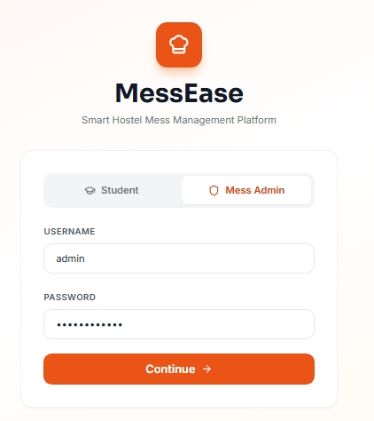
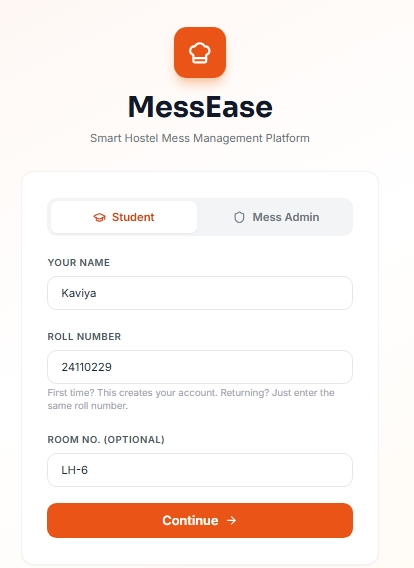
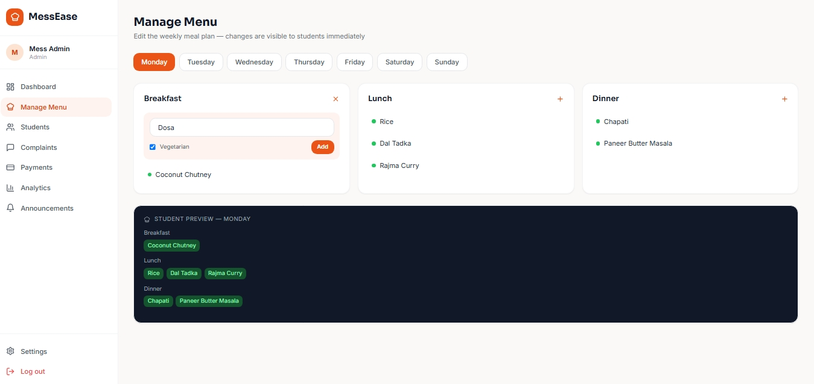
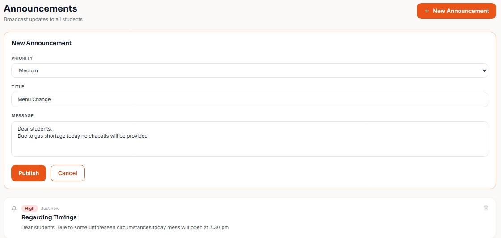
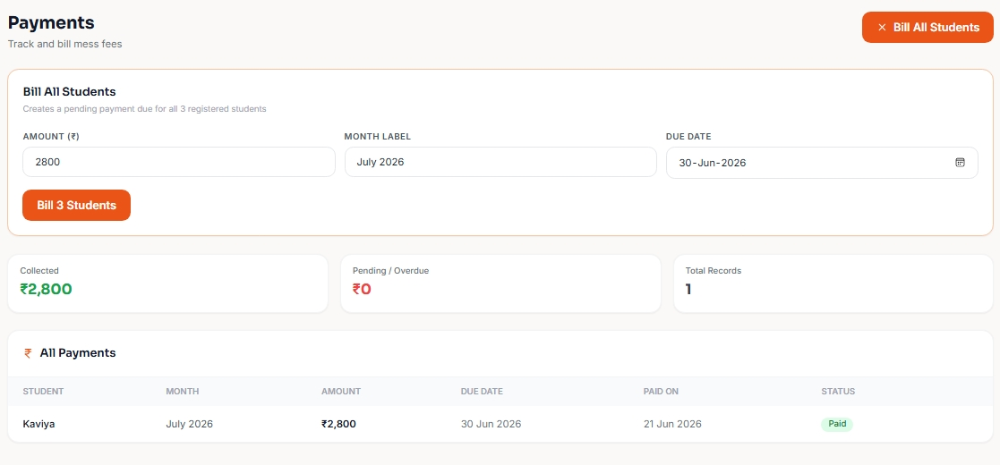
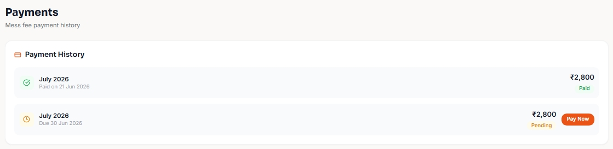
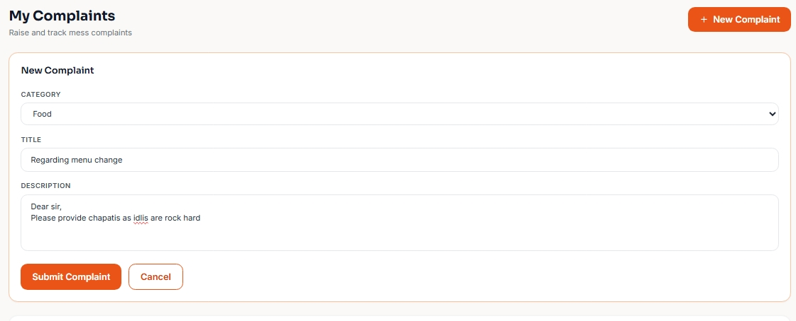
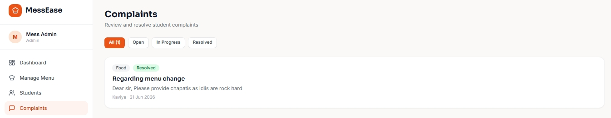
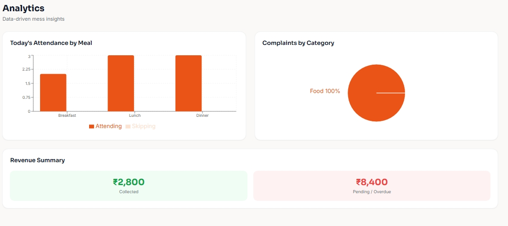

# MessEase 🍽️

A Smart Mess Management Platform for hostels and educational institutions — built with **React, TypeScript, Tailwind CSS, Vite, and Supabase** (Postgres + Realtime).

MessEase connects students and mess administrators on one shared, live platform: real-time menu updates, meal attendance tracking (so the mess manager actually knows how many students are coming to each meal), structured complaint handling, fee billing/payment tracking, and analytics — all backed by a real database.

## Login model

- **Students** log in with just **name + roll number** — no password. 
- **Mess Admin** is a single fixed account 


## How it answers "how does the mess manager know how many students are coming?"

Every student marks attendance per meal (breakfast/lunch/dinner) from their dashboard. That write goes straight into a shared Postgres `attendance` table. The admin dashboard reads a live `todays_attendance_summary` view and **subscribes to realtime changes** — so the headcount updates automatically, across devices, the moment any student toggles their attendance. No refresh needed.

## Features

**Student Portal**
- Log in with name + unique roll number (self-registers on first login, no password)
- Dashboard: wallet balance, today's meals, attendance status, latest announcement
- Weekly menu viewer (veg/non-veg tagged, calories)
- Mark daily meal attendance (breakfast / lunch / dinner) — visible to admin live
- Raise & track complaints (food, hygiene, service, billing)
- Payment history
- Announcements feed

**Admin Portal** (single fixed login)
- Live today's headcount by meal 
- Student directory (real registered students)
- Manage weekly menu (add/remove items per day per meal — visible to students instantly)
- Complaint triage (open → in-progress → resolved)
- Bill all students at once for a month's mess fee; mark individual payments as paid
- Analytics: live attendance by meal, complaint breakdown, revenue summary
- Publish / delete announcements

## Tech Stack

- **React 18** + **TypeScript**
- **Vite** — build tool
- **Tailwind CSS** — styling
- **React Router v6** — routing
- **Supabase** — Postgres database, authentication, row-level security, realtime subscriptions
- **Recharts** — charts/analytics
- **Lucide React** — icons

## Output: 

## Login Page [Admin]



## Login Page [Student]



## Dashboard



## Announcement



## Billing



## Payment



## Students Complaints



## Admin Complaints Resolve



## Admin Analytics



## Setup

### 1. Create a Supabase project

Go to [supabase.com](https://supabase.com), create a free account and a new project. 

### 2. Run the database schema

In your Supabase project dashboard, go to **SQL Editor → New query**, paste the entire contents of `supabase/schema.sql` from this repo, and click **Run**.


### 3. Get your API keys

Dashboard → **Settings → API Keys**. Copy:
- **Project URL**
- **Publishable key** (`sb_publishable_...`) — safe to use in the browser

### 4. Configure environment variables

```bash
cp .env.example .env
```

Edit `.env` and paste in your values:

```
VITE_SUPABASE_URL=https://your-project-ref.supabase.co
VITE_SUPABASE_PUBLISHABLE_KEY=sb_publishable_xxxxxxxxxxxxxxxxxxxx
VITE_ADMIN_USERNAME=admin
VITE_ADMIN_PASSWORD=messease2026
```

(The admin username/password can be anything you want — these are just the defaults.)

### 5. Install and run

```bash
npm install
npm run dev
```

Open `http://localhost:5173`. 
## Project Structure

```
supabase/
└── schema.sql           # Full DB schema, RLS policies, view, seed data — run this in Supabase SQL editor

src/
├── components/
│   └── layout/           # Sidebar, AppLayout
├── hooks/
│   └── useAuth.ts        # Roll-no student login + fixed admin login, session in localStorage
├── lib/
│   ├── supabase.ts        # Supabase client instance
│   ├── adminAuth.ts        # Fixed admin credential check
│   ├── utils.ts              # Formatters, cn() helper
│   └── api/                   # Data access layer — one file per domain
│       ├── auth.ts             # profiles: login-or-register by roll no
│       ├── attendance.ts        # mark attendance, live headcount summary, realtime subscription
│       ├── complaints.ts         # raise/list/update complaints
│       ├── payments.ts            # bill students, list, mark paid
│       └── content.ts              # menu items, announcements
├── pages/
│   ├── student/            # Student-facing pages
│   └── admin/               # Admin-facing pages
├── types/
│   └── index.ts             # Shared TypeScript types
├── App.tsx                   # Routes + auth-gated layout
└── main.tsx                   # Entry point
```

## Database schema (high level)

| Table | Purpose |
|---|---|
| `profiles` | One row per student — `roll_no` is unique and is the login key |
| `menu_items` | One row per dish, tagged by day + meal |
| `attendance` | One row per student/date/meal — this is the headcount data |
| `complaints` | Student-raised complaints with category/status |
| `payments` | Fee dues per student per month |
| `announcements` | Admin broadcasts |

There's no Supabase Auth involved, so row-level security is intentionally open (any client can read/write) — access control is enforced in the app's UI/routing instead, not at the database layer. See the comment block at the top of `supabase/schema.sql` for the full reasoning and what to tighten if you ever go beyond a trusted classroom demo.

## Future Enhancements: 

- **No real authentication** — student login is name + roll number with no password, and admin is one fixed account.
- **RLS is wide open** — since there's no `auth.uid()` to key policies off, every table currently allows any client to read/write. So we can add Supabase Auth + tighten RLS to scope each student to their own rows before this touches real data."
- **Payments are tracked, not processed** — "Pay Now" / billing doesn't move real money. Wiring up Razorpay or Stripe Checkout is the natural next step.
- **No push notifications** — announcements just live in the database; a service worker + Web Push (or Supabase's realtime channel, which is already used for attendance) could notify students live.
- **Wallet balance is just a number on the profile** — there's no transaction ledger yet. Useful enhancement: a `wallet_transactions` table for an auditable history.


